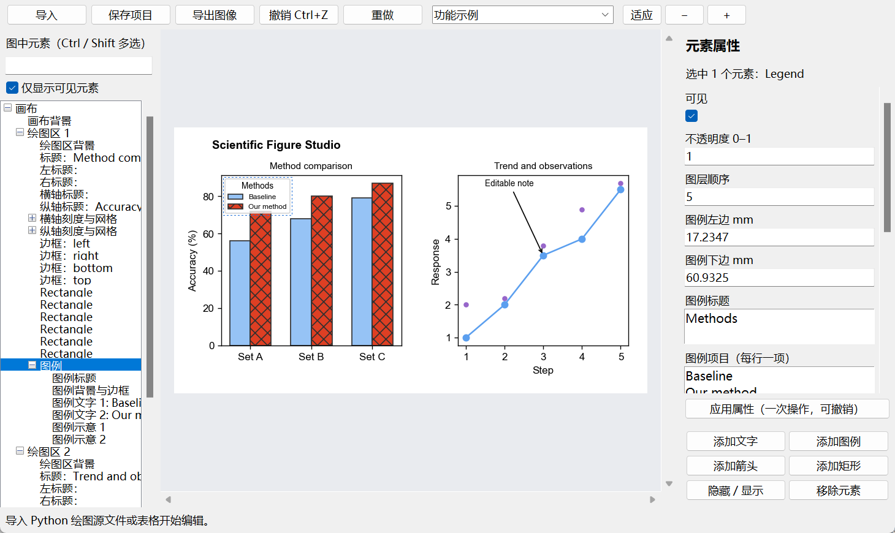

<p align="center">
  
</p>

<p align="center">
  <a href="https://github.com/GML0226/SCI-Figure-Studio/releases/tag/v1.0"></a>
  &nbsp;
  
  &nbsp;
  
</p>

<p align="center">
  <strong>让科研图的每个细节，都能直观调整。</strong><br>
  导入绘图源文件或数据，调整文字、图例和布局，保存为可继续编辑的项目。
</p>

<p align="center">
  <a href="https://github.com/GML0226/SCI-Figure-Studio/releases/download/v1.0/ScientificFigureStudio_v1.0_Windows_x64.zip"></a>
</p>

<p align="center">
  <a href="#快速开始">快速开始</a> &nbsp;·&nbsp;
  <a href="#主要功能">主要功能</a> &nbsp;·&nbsp;
  <a href="#快捷键">快捷键</a> &nbsp;·&nbsp;
  <a href="https://github.com/GML0226/SCI-Figure-Studio/issues">反馈问题</a>
</p>

---

**SCI Figure Studio** 是一个在本地运行的科研图像编辑工具。你可以导入 Matplotlib 绘图源文件或数据表，通过点击、拖动和属性面板修改图像，再导出 SVG、PDF、PNG 或 TIFF。

Windows 便携版内置运行环境，**解压即可使用，无需安装 Python 或额外绘图软件**。

<p align="center">
  
</p>

## 界面预览

<p align="center">
  
</p>

<p align="center"><sub>左侧选择元素 · 中间实时预览 · 右侧调整属性</sub></p>

## 快速开始

1. **下载并解压**：[Windows 便携版 · v1.0](https://github.com/GML0226/SCI-Figure-Studio/releases/download/v1.0/ScientificFigureStudio_v1.0_Windows_x64.zip)。
2. **启动程序**：双击 `ScientificFigureStudio.exe`。
3. **导入内容**：打开 `.py` 绘图脚本、Excel/CSV/TSV 表格或 `.sfig` 项目。
4. **调整图像**：点击图中元素，或从左侧元素树选择；修改右侧属性后点击 **应用属性**。
5. **保存与导出**：保存 `.sfig` 以便继续编辑，或导出所需图像格式。

初次使用可以导入便携包中的 `example.sfig`，或通过 **文件 → 打开功能示例** 体验编辑功能。

> **文件名说明**：项目现名为 SCI Figure Studio，v1.0 安装包和启动文件保留 `ScientificFigureStudio` 文件名。

## 主要功能

| 编辑对象 | 可以调整的内容 |
| :--- | :--- |
| **文字与注释** | 标题、轴标题、刻度和注释的内容、字体、字号、颜色、旋转、位置与对齐 |
| **图例** | 原生图例标题、项目文字、列数、字号、间距、示意图形、边框与位置 |
| **图形元素** | 柱子、形状、线条、散点、热图和色条的常用外观与几何属性 |
| **画布与坐标轴** | 画布尺寸（mm）、绘图区位置与比例、坐标范围、线性/对数尺度、网格和输出 DPI |
| **布局与操作** | 拖动、多选、批量修改、对齐、隐藏、删除，以及添加文字、图例、箭头和矩形 |
| **项目与输出** | 保存可编辑 `.sfig` 项目；导出 SVG / PDF / PNG / TIFF；默认 600 dpi，可调整 |

预览缩放不会改变导出的物理尺寸。SVG 导出保留可编辑文字，方便后续排版。

## 快捷键

| 操作 | 快捷键 / 手势 |
| :--- | :--- |
| 撤销 / 重做 | `Ctrl+Z` / `Ctrl+Y` 或 `Ctrl+Shift+Z` |
| 导入 / 保存 / 导出 | `Ctrl+O` / `Ctrl+S` / `Ctrl+E` |
| 项目另存为 | `Ctrl+Shift+S` |
| 移动元素 | 拖动；方向键每次移动 0.2 mm |
| 较大幅度微调 | `Shift` + 方向键，每次移动 1 mm |
| 调整绘图区宽高 | 按住 `Shift` 拖动绘图区 |
| 调整文字字号 | 按住 `Shift` 拖动文字，上移增大、下移减小 |
| 多选 / 删除 / 取消拖动 | `Ctrl` 点击 / `Delete` / `Esc` |
| 预览缩放 | 工具栏 `+` / `−`；图中 `Ctrl` + 滚轮 |

一次完整拖动或一次“应用属性”计为一步撤销。历史最多保留 40 步，历史内存上限约 64 MiB；大型图像可能保留较少步数。

## 导入与支持范围

| 输入 | v1.0 支持方式 |
| :--- | :--- |
| **Python 绘图源文件** | 捕获 Matplotlib 脚本生成的 Figure；支持多张图及 `build_figure()` 函数 |
| **Excel / CSV / TSV** | 选择类别列、数值列和图形类型；支持分组柱状图、横向柱状图、折线图、散点图 |
| **`.sfig` 项目** | 恢复已保存的图像和可编辑元素 |
| **PNG / JPG / TIFF** | 作为底图导入；其中栅格化的文字和曲线仍为像素 |

便携版内置 **Matplotlib、NumPy、openpyxl 和 Python 标准库**。为控制体积，未包含 pandas、SciPy、seaborn、PyTorch；使用这些库的脚本可改用内置库，或将数据导出为 CSV/Excel 后导入。

源文件和数据文件保持原有相对位置即可。Python 脚本导入会执行脚本，`.sfig` 会恢复序列化对象，请使用可信来源的文件。标准 Matplotlib 元素可编辑，第三方自定义 Artist 的特殊属性不保证支持。v1.0 支持 SVG 导出，暂不支持完整 SVG 重新解析导入。

<details>
<summary><strong>开发者：从源码运行与构建</strong></summary>

使用 Windows Python 3.12，在仓库根目录执行：

```powershell
python -m pip install -r requirements.txt
python src/app.py
```

重新构建便携 EXE：

```powershell
.\build.ps1
```

构建脚本会创建独立虚拟环境并安装 PyInstaller，程序输出至 `portable/`。普通用户运行便携版无需这些开发依赖。

通用示例：[绘图源文件](examples/source_template.py) · [表格数据](examples/methods.csv)

| 路径 | 内容 |
| :--- | :--- |
| `src/` | 界面、编辑模型、导入模块和行为检查 |
| `assets/` | 程序图标 |
| `examples/` | 通用绘图与数据示例 |
| `docs/` | 界面预览、项目标志和 README 图像 |
| `requirements.txt` | 源码运行依赖 |
| `build.ps1` / `ScientificFigureStudio.spec` | Windows 打包配置 |

`docs/branding/` 中提供 SVG / PNG 标志与横幅，运行 `build_branding.py` 可重新生成。

</details>

---

<p align="center">
  <strong>SCI Figure Studio</strong><br>
  <sub>Precision editing for scientific figures.</sub><br>
  <a href="https://github.com/GML0226/SCI-Figure-Studio/releases">查看发布版本</a> &nbsp;·&nbsp;
  <a href="https://github.com/GML0226/SCI-Figure-Studio/issues">报告问题或建议</a>
</p>

<p align="center"><sub>便携包中保留了内置第三方组件的许可证文件。</sub></p>
